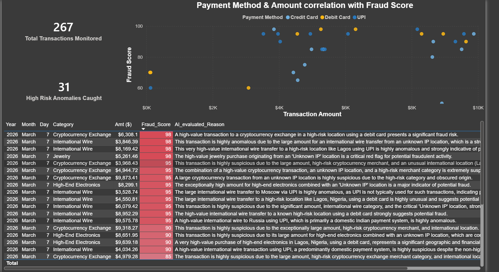

# 🚀 Real-Time GenAI Fraud Detection Engine

## Overview
An end-to-end, serverless data pipeline that ingests real-time financial transactions and leverages Generative AI (Google Gemini 2.5 Flash) to evaluate contextual fraud risk on the fly. This project was built with a strict focus on cost-optimization, micro-batching, and the Medallion Data Lake architecture.

*(Note: Upload your Power BI screenshot to the repo and name it dashboard.png for this image to load!)*

## 🏗️ Cloud Architecture

The system operates entirely within the AWS Free Tier using highly scalable, serverless components.

**The Pipeline Flow:**
`Local Python Producer` ➡️ `AWS Kinesis (Bronze)` ➡️ `AWS Lambda + GenAI API` ➡️ `Amazon S3 (Silver JSONL)` ➡️ `Amazon Athena` ➡️ `Power BI`

1. **Ingestion Layer:** A custom Python script generates synthetic transaction streams (including randomized anomalous behaviors) and pushes them to **Amazon Kinesis**.
2. **Processing & AI Brain:** **AWS Lambda** polls Kinesis, micro-batches the incoming records, and makes a single HTTP request to the **Gemini 2.5 Flash API**. The LLM evaluates the context (amount, location, merchant, time) and returns a structured JSON payload containing a `fraud_score` and a contextual `ai_reason`.
3. **Storage Layer:** Lambda stitches the AI intelligence back into the payload and writes the enriched data as JSON Lines (JSONL) into an **Amazon S3 Data Lake**, dynamically partitioned by date (`year=YYYY/month=MM/day=DD`).
4. **Serving Layer:** **Amazon Athena** maps the S3 partitions to an external schema, allowing serverless SQL querying directly against the raw files.
5. **Analytics Layer:** **Power BI** connects to Athena via ODBC to provide a live "Cyber-Security Operations Center" dashboard for fraud analysts.

## 🛠️ Tech Stack
* **Languages:** Python 3.12, SQL
* **AWS Cloud:** Kinesis Data Streams, Lambda, S3, Athena, IAM, CloudWatch
* **AI/ML Integration:** Google Gemini 2.5 Flash API (Prompt Engineering, Structured JSON Outputs)
* **Analytics & Visualization:** Power BI, AWS ODBC Driver

## 💡 Key Engineering Highlights
* **Fault Tolerance:** Implemented `try/except` blocks around the external LLM API call. If the AI times out or hits a quota limit, the pipeline gracefully assigns a fallback score and keeps streaming without dropping records.
* **Cost Optimization:** Scaled Lambda timeouts appropriately and used micro-batching to drastically reduce external API calls, keeping cloud infrastructure costs at effectively $0.00.
* **Big Data Standards:** Landed data in S3 using Hive-style partitions and the JSONL format to ensure infinite scalability and efficient Athena querying.

## 🚀 How to Run (Architecture Replication)
1. Configure AWS CLI with IAM credentials.
2. Spin up the Kinesis Data Stream using the AWS Console or boto3.
3. Deploy the `lambda_function.py` and set the `GEMINI_API_KEY` as an environment variable. Give the Lambda execution role `AmazonS3FullAccess`.
4. Run `advanced_producer.py` locally to begin streaming synthetic data.
5. Execute the Athena DDL queries to build the schema over the S3 bucket and run `MSCK REPAIR TABLE` to load partitions.

